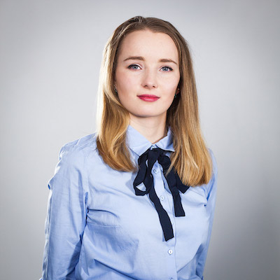
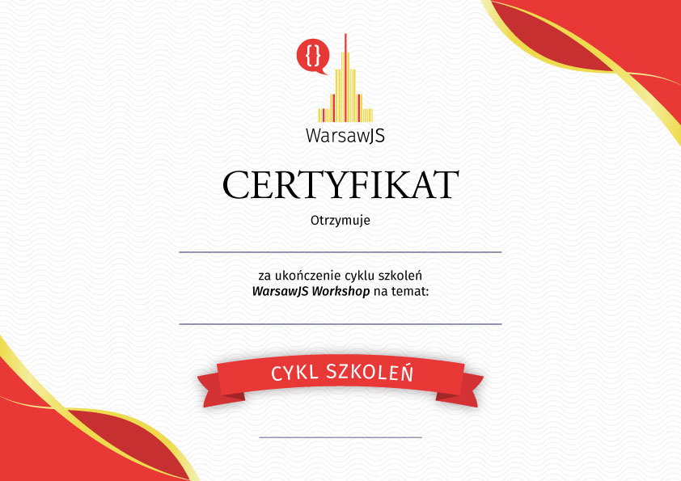
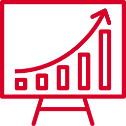
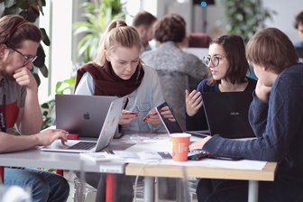
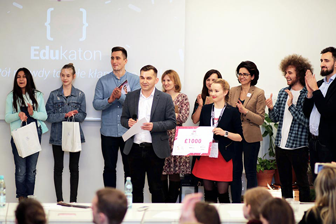
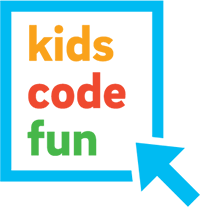
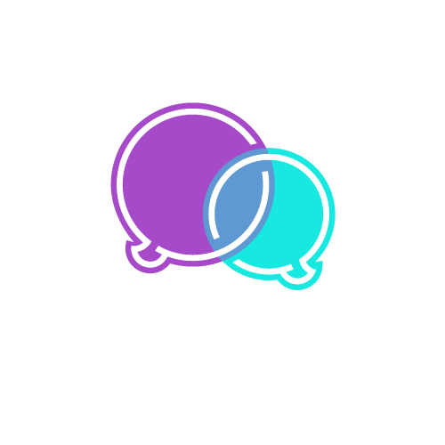

class: slide-front-page

.logo[

]
.details[

## Katarzyna Grabowska
## <em>"Podsumowanie 4-letniej działalności WarsawJS" [PL]</em>
## <small>2018-09-12</small>
## <a href="https://www.linkedin.com/in/katarzyna-grabowska-designer">linkedin.com/in/katarzyna-grabowska-designer</a>
]

---

# Czego się nauczyliśmy?

.size50[

* Live cooking pizza
* Warszaty cieszą się dużą popularnością
* Pierwszy cykl szkoleń: _Testowanie kodu_ (certyfikat)

]

---

class: middle, center, no-display-twitter-handle

---

class: top, center

.size80[
Statystyki zeszłego roku!
]
.box.center[

]

---

### <samp>YouTube.com</samp>

.size50[

* _106 246_ wyświetleń
* <mark>1 454</mark> subskrypcje
    + wzrost o <var>+413</var>

]

---

class: center

### Najpopularniejsza prezentacja <samp>2 408 wyświetleń<samp>

*Jakub Skałecki* "Vue.js - udany mix React.js i Angular.js"

<iframe width="560" height="315" src="https://www.youtube.com/embed/SM8eJPw1JeA" frameborder="0" allow="autoplay; encrypted-media" allowfullscreen></iframe>

---

### <samp>Meetup.com</samp>

.size50[

* _3 974_ osób w organizacji (stan o 16:41)
    + wzrost o <var>+1 306</var>

]

.text-center[

## <mark>Dołączajcie, aby pobić granice 4k!</mark>

]

---

### <samp>Twitter.com</samp>

.size50[

* <mark>648</mark> osób obserwujących
    + wzrost o <var>+218</var>

]

.text-center[

## _Tweetujcie z hashtagiem_ `#warsawjs`

]

---

class: middle, center

# Inicjatywy

---

class: center, slide-middle-images, no-display-twitter-handle

### Edukaton 16.02.2018 - 18.02.2018

---

class: middle, center

# 🌟 Nowości w WarsawJS 🌟

---

class: middle, center, slide-invert-colors

## Robimy konferencje!

29 października 2018

---

class: slide-invert-colors

# ConFrontJS 2018

.size30[
* Sprzedaż biletów: <mark>~~Właśnie teraz!~~</mark>
    + <samp>za kilka dni</samp>
* Gdzie? _Campus Warsaw_
* Kiedy? _29 października_
* Limit miejsc: _150_
* Uruchomienie "Call for papers": <mark>~~Właśnie teraz!~~</mark>
    + <samp>za kilka dni</samp>

]

---

class: slide-invert-colors

# ConFrontJS 2018

.size50.text-center[

Zostań sponsorem! 💸

]

.size50[

* Gold 🥇
* Silver 🥈
* Bronze 🥉

]

---

class: middle, center

# Nowa strona domowa! 🎊

.size90[

[warsawjs.herokuapp.com](https://warsawjs.herokuapp.com)

]

_(adres tymczasowy, czekamy na DNSy)_

---

class: middle

.text-center[

# Blog
]

.size50.text-center[

🗣 Poszukujemy blogerów! 🗣

]

* Opublikowaliśmy <var>dziś</var> artykuł Michała!
* Korzystamy z _Medium.com_

---

# Meetup 👋

.size50[

* Zdobywanie wiedzy
* Poznanie nowych osób
* Zdobywanie pracowników
* Poznawania nowych pracodawców
* Spróbowania sił jako prelegent

]

---

class: middle

# Dziękuję

## ...i zapraszam na tort! 🎂
